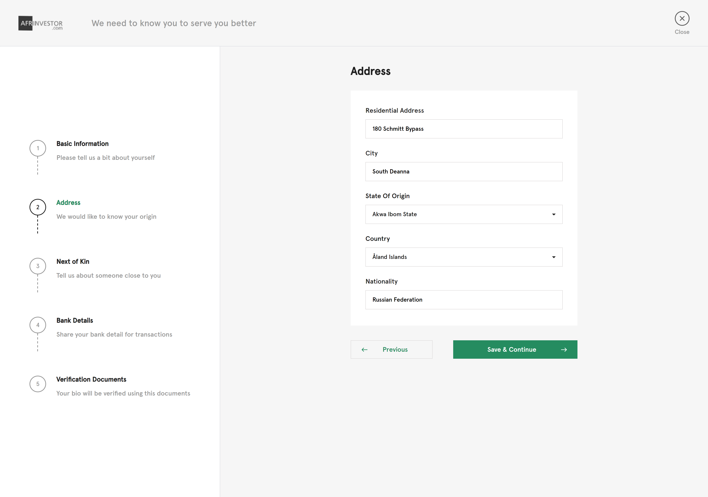

  <p align="center">An investment Portfolio website built with React and Typescript</p>



- With Custom design system

- Live application [https://investment-portfolio.netlify.app](https://investment-portfolio.netlify.app)

## Installation

```bash
# Install dependencies
$ yarn install

# Copy and rename .env.sample to .env
$ cp .env.sample .env
```


## Running the app

```bash
# build the app for production
$ yarn build

# development
$ yarn start:dev
```

App can be accessed via http://localhost:9000 in development environment.
